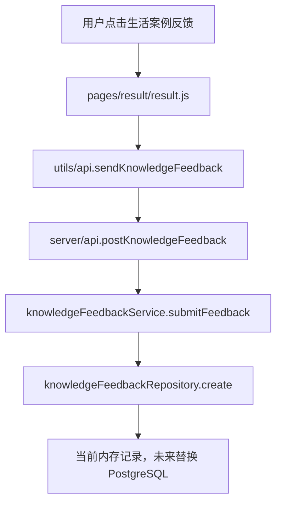

# AI大白话知识解释反馈系统报告

完成时间：2026-07-30

## 修改文件

前端：

- `pages/result/result.wxml`
- `pages/result/result.js`
- `pages/result/result.wxss`
- `utils/api.js`

服务端：

- `server/api.js`
- `server/models/knowledgeFeedback.js`
- `server/repositories/knowledgeFeedbackRepository.js`
- `server/services/knowledgeFeedbackService.js`

数据库：

- `database/migrations/009_knowledge_feedback.sql`

## 数据结构

新增逻辑表：`knowledge_feedback`

字段：

| 字段 | 类型 | 说明 |
| --- | --- | --- |
| `id` | string | 反馈记录唯一 ID |
| `term` | string | 被反馈的词条或问题 |
| `section` | string | 反馈区域，当前支持 `lifeExample` |
| `exampleIndex` | number | 当前生活案例下标 |
| `feedbackType` | string | `understood` 或 `not_understood` |
| `createdAt` | datetime | 创建时间 |

数据库迁移字段：

```sql
CREATE TABLE IF NOT EXISTS knowledge_feedback (
  id VARCHAR(128) PRIMARY KEY,
  term VARCHAR(256) NOT NULL,
  section VARCHAR(64) NOT NULL,
  example_index INTEGER NOT NULL DEFAULT 0,
  feedback_type VARCHAR(32) NOT NULL,
  created_at TIMESTAMPTZ NOT NULL DEFAULT NOW()
);
```

当前内存记录结构：

```json
{
  "id": "kf_1785395800597_biaekqnx",
  "term": "Token",
  "section": "lifeExample",
  "exampleIndex": 1,
  "feedbackType": "not_understood",
  "createdAt": "2026-07-30T07:16:40.597Z"
}
```

## 前端流程

结果页生活案例卡片下新增问题：

```text
这个例子容易理解吗？
```

按钮：

- `👍 看懂了`
- `👎 没看懂`

点击后提交：

```js
api.sendKnowledgeFeedback({
  term,
  section: 'lifeExample',
  exampleIndex: resultData.currentExampleIndex || 0,
  feedbackType
})
```

提交成功后只显示 Toast，不改变解释内容，不切换案例，不删除案例。

## 服务端流程



## API 行为

新增服务端方法：

```js
serverApi.postKnowledgeFeedback(payload)
```

返回：

```json
{
  "success": true,
  "data": {
    "id": "",
    "term": "",
    "section": "lifeExample",
    "exampleIndex": 0,
    "feedbackType": "understood",
    "createdAt": ""
  }
}
```

当前保持匿名提交：

- 不要求登录
- 不要求用户 ID
- 不影响原 `/api/explain`
- 不影响知识库命中

## 验证结果

语法检查：

- `server/api.js`：通过
- `server/services/knowledgeFeedbackService.js`：通过
- `server/repositories/knowledgeFeedbackRepository.js`：通过
- `server/models/knowledgeFeedback.js`：通过
- `utils/api.js`：通过
- `pages/result/result.js`：通过

接口测试：

```json
{
  "success": true,
  "data": {
    "term": "Token",
    "section": "lifeExample",
    "exampleIndex": 1,
    "feedbackType": "not_understood"
  }
}
```

结果页事件测试：

```json
{
  "toast": "已记录：没看懂"
}
```

## 约束确认

本次没有：

- 修改知识库内容
- 删除任何生活案例
- 改变解释流程
- 改变知识库优先命中逻辑
- 要求用户登录
- 增加自动淘汰或自动生成补位逻辑

## 后续自动淘汰扩展方案

后续可以基于 `knowledge_feedback` 增加质量分析，不建议立即自动删除内容。

建议分三步：

1. 统计层
   - 按 `term + section + exampleIndex` 聚合反馈
   - 计算 `not_understood_rate`
   - 统计最低理解率案例排行

2. 审核层
   - 当同一案例 `没看懂` 达到阈值，例如 20 次
   - 或 `not_understood_rate > 40%`
   - 自动进入人工审核队列

3. 生成补位层
   - 由混元生成新生活案例草稿
   - 草稿进入 pending review
   - 人工审核通过后再替换或追加到知识库

关键原则：

- 不自动删除正式知识库内容
- 不让模型直接改正式词条
- 所有替换都进入人工审核
- 保留原案例反馈历史，便于追溯

